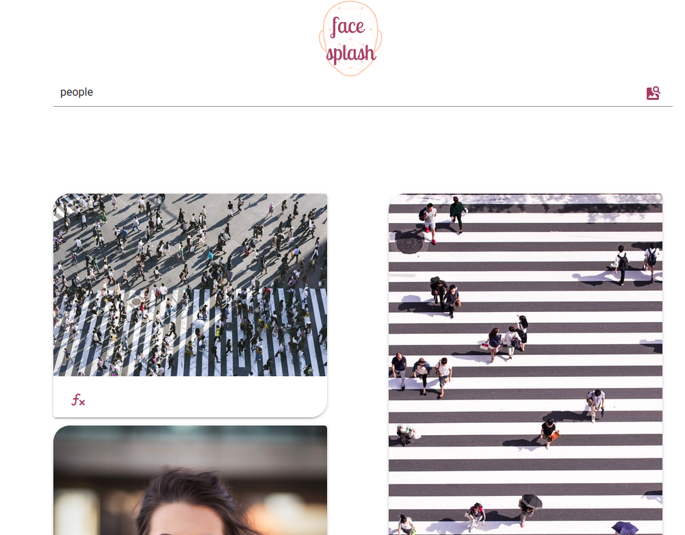

# Face Splash


---

# Overview

Facial, sentiment, age, and sex detection analysis of Unsplash images. The application is built using Vue 3, Unsplash API, and [justadudewhohack's](https://github.com/justadudewhohacks) [face-api.js](https://justadudewhohacks.github.io/face-api.js/docs/index.html).

[**Live Demo**](https://face-splash.herokuapp.com/)

# Local Deployment

To run Face Splash locally, you can either clone

```
git clone https://github.com/NElnour/face-splash.git
```

or download this respository as a ZIP from

After the ZIP file is downloaded, unzip the file and change your current directory to `/face-splash`.

## Project setup

Before running the application, ensure that all dependencies are installed and up to date by running in the command line

```
npm install
```

Afterwards, you can proceed run one of the three following modes

1. Compile and hot-reload for development:

```
npm run serve
```
2. Compile and minify for production:

```
npm run build
```
3. Lint and fix files:

```
npm run lint
```

# Using Face Splash
Face Splash has an intuitive search-and-analyze interface. To begin, type into the search field what you would like to search Unsplash for. For example, try typing **"people"** like below and either press the **Enter key** or **click on the search icon** on the far right


If you see an image that you would like to analyze, click on the ***fx*** icon below the image 

and a dialog should open with four buttons at the top and an empty canvas. **To analyze the image**, you can click on any of the three left-most buttons.

**To exit the dialog**, you can click on the "x" icon as highlighted below and the canvas will be cleared.


## Face Detection
You can detect faces in an image by clicking the **left-most button** on the dialog as highlighted below

The image will be drawn along with box corresponding to the aspects of the image that are predicted to be a face. The number that appears denotes the probability that the image aspect is a face. I set the convolutional neural net (CNN) to the **SsdMobilenetv1** model with a **minimum confidence threshold of 0.5**.

## Facial Expression (Sentiment) Detection
To predict sentiment in the image, click on the **second left-most button** as highighted below

A text box will appear with the emotion (here, "happy") as well as the probability that the emotion is present in the predicted face (in this case, 0.99).

## Age and Sex Detection
Finally, you can also get the model to guess the detected face's age and sex by clicking on the **third left-most button** of the dialog 

The textbox that appears lists the predicted sex of the detected face along with its prediction probability. It also lists the predicted age of the detected face.

# Development & Contribution Guides
You are welcome to add features to Face Splash. As a guideline, if you implement changes or features, you can ask for their inclusion through [Pull Requests](https://github.com/NElnour/face-splash/pulls).  Please make sure you have the following for your pull request:
* a summary of changes you made and their purpose as part of your pull request message; and
* the **enhancement** tag as the pull request's label.

If you find issues or bugs, simply submit a new issue in the [Issues Tracker](https://github.com/NElnour/face-splash/issues) and I will try to respond promptly.

## Contributor
Face Splash was developed by [Nada Elnour](https://github.com/NElnour). It was inspired by one of [Mintbean's](https://www.mintbean.io/) hackathons, [PhotoHack](https://www.mintbean.io/mb-event/db790794-7bc6-4e58-b3f3-8fa689220079), which I unfortunately missed.

# License
Face Splash is under [MIT License](./LILCENSE)

